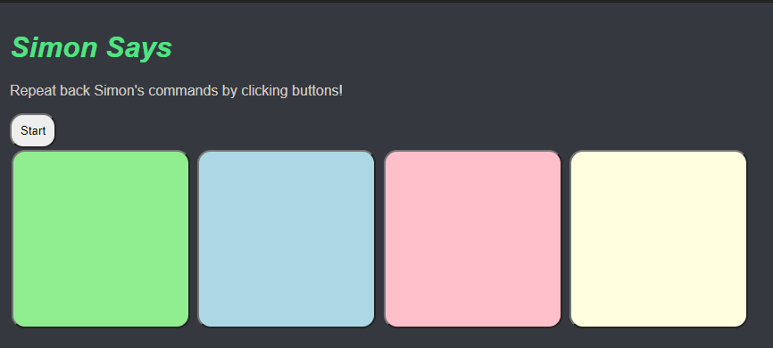

# Pre-work - _Memory Game_

**Memory Game** is a Light & Sound Memory game to apply for CodePath's SITE Program.

Submitted by: **Phillip Dang**

Time spent: **3** hours spent in total

Link to [project](https://philripd-site-prework.glitch.me/)

I followed CodePath's prework [documentation](https://courses.codepath.org/snippets/summer_internship_for_tech_excellence/prework) to develop this project.

This readme is based on CodePath's [template](https://hackmd.io/YIMgxXoFSDSHv1clapGzfg?edit).

## Required Functionality

The following **required** functionality is complete:

- [x] Game interface has a heading (h1 tag), a line of body text (p tag), and four buttons that match the demo app
- [x] "Start" button toggles between "Start" and "Stop" when clicked.
- [x] Game buttons each light up and play a sound when clicked.
- [x] Computer plays back sequence of clues including sound and visual cue for each button
- [x] Play progresses to the next turn (the user gets the next step in the pattern) after a correct guess.
- [x] User wins the game after guessing a complete pattern
- [x] User loses the game after an incorrect guess

The following **optional** features are implemented:

- [ ] Any HTML page elements (including game buttons) has been styled differently than in the tutorial
- [ ] Buttons use a pitch (frequency) other than the ones in the tutorial
- [ ] More than 4 functional game buttons
- [ ] Playback speeds up on each turn
- [x] Computer picks a different pattern each time the game is played
- [ ] Player only loses after 3 mistakes (instead of on the first mistake)
- [ ] Game button appearance change goes beyond color (e.g. add an image)
- [ ] Game button sound is more complex than a single tone (e.g. an audio file, a chord, a sequence of multiple tones)
- [ ] User has a limited amount of time to enter their guess on each turn

## Video Walkthrough

Here's a walkthrough of implemented user stories:

## Reflection Questions

1. If you used any outside resources to help complete your submission (websites, books, people, etc) list them here.

   Documentation
   - [Mozilla Web Docs - Math.random()](https://developer.mozilla.org/en-US/docs/Web/JavaScript/Reference/Global_Objects/Math/random)
   - [W3Schools CSS Tutorials - CSS Backgrounds](https://www.w3schools.com/css/css_background.asp)
   
   Colors
   - [Discord](https://discord.com/)
   - [Spotify](https://www.spotify.com/)

2. What was a challenge you encountered in creating this submission (be specific)? How did you overcome it? (recommended 200 - 400 words)
   
    A challenge I encountered in creating this submission was in customizing the look of the app. I wanted the app to have a dark theme, as it would be easier on viewers' eyes. Initially, I changed the background color in the body tag, but its scope did not cover the entire app. Consequently, some portions looked unchanged from default values. I researched how to change the background color for the entire app, and the solution was to use the html tag. This made sense to me because the html tag encompassed all other elements. I implemented the change by using Discord's dark theme primary background color, gray, and I was pleased to see it work.

    I applied my new knowledge of scopes to change the color of the text and the start/stop button. Since my app now had a dark background, I had to select colors which complemented one another. Going off of Discord, I used their dark theme message text color for the app's description and button text. I used Spotify's green logo color for the header text. Finally, for the start/stop button background, I chose black as it allowed the button to stand out without it becoming an eyesore.

3. What questions about web development do you have after completing your submission? (recommended 100 - 300 words)
   
    Since my first year of high school, I researched career paths I could pursue. I was particularly interested in computer science. Diving deeper, I noticed there was a lot of hype around web development. Online forums were filled with words such as Node.js, React, and AWS. Web developer internships and job postings listed requirements featuring these technologies. This trend is prevalent today. I am aware they are the backbone of all the beautiful, high-performing websites I visit today. I would like to know how and why these technologies became so popular among web developers. Furthermore, how did these technologies become industry standard?

4. If you had a few more hours to work on this project, what would you spend them doing (for example: refactoring certain functions, adding additional features, etc). Be specific. (recommended 100 - 300 words)
   
   If I had a few more hours to work on this project, I would implement more of the optional features listed on the CodePath prework [documentation](https://courses.codepath.org/snippets/summer_internship_for_tech_excellence/prework#heading-12-optional-features). I would add a difficulty toggle button that modifies the clue playback time and how much time the player has to make their guesses. When the player clicks the button, the game switches between three difficulty states (i.e. Easy, Medium, Hard). The limited time-to-guess mechanic would need to be implemented before implementing the difficulty toggle button. Other optional features such as the three-strikes mechanic and changing the sounds would only need some research and experimentation.

## License

    Copyright Phillip Dang

    Licensed under the Apache License, Version 2.0 (the "License");
    you may not use this file except in compliance with the License.
    You may obtain a copy of the License at

        http://www.apache.org/licenses/LICENSE-2.0

    Unless required by applicable law or agreed to in writing, software
    distributed under the License is distributed on an "AS IS" BASIS,
    WITHOUT WARRANTIES OR CONDITIONS OF ANY KIND, either express or implied.
    See the License for the specific language governing permissions and
    limitations under the License.
